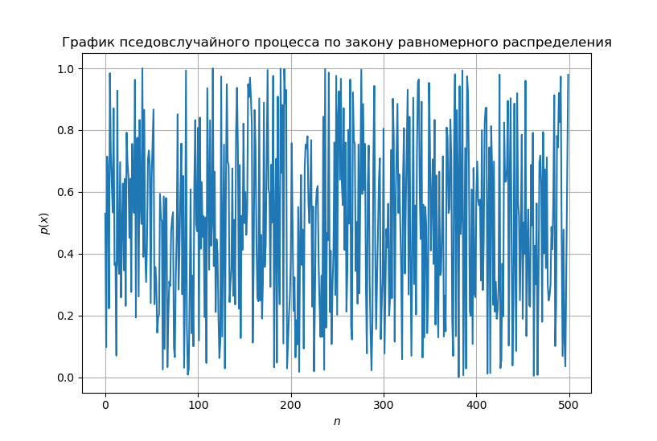
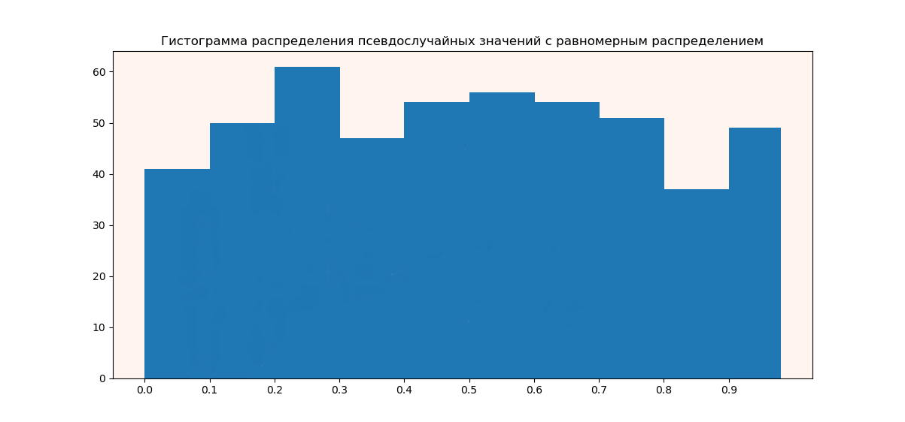
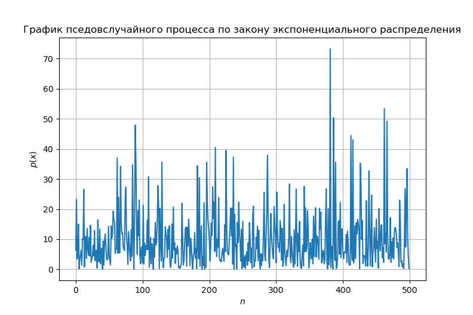
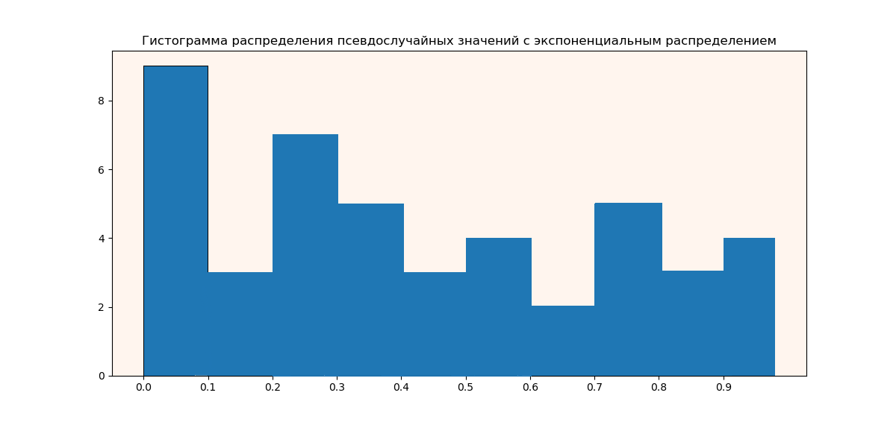
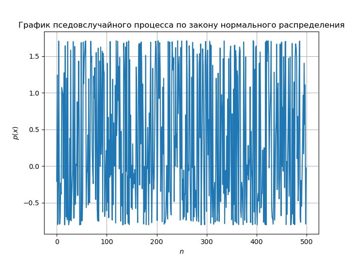
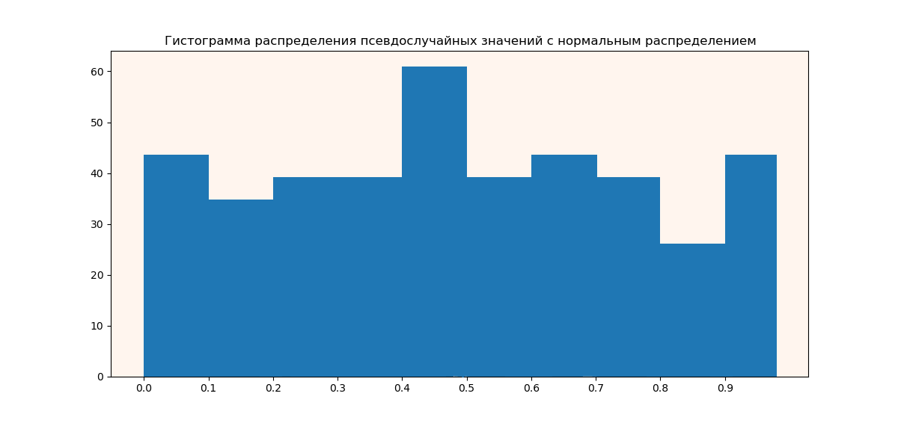

# StochasticSimulator
Coursework from the University program

Необходимо разработать класс "Стохастический симулятор распределения". Поле данных - входной массив случайных равномерно распределенных чисел.
Методы возвращают экспоненциальное, гауссовское и равномерное распределения.

Генератор псевдослучайных чисел — алгоритм, порождающий последовательность чисел, элементы которой почти независимы друг от друга и подчиняются
заданному распределению (обычно равномерному, однако зачастую это ограниченное распределение).
Гистограммы с большим количеством пиков (многомодальные) встречаются крайне редко и, зачастую свидетельствуют о присутствии специальных факторов,
влияющих на исследуемую систему или процесс. Если каждый интервал гистограммы содержит примерно равное количество значений, то такая гистограмма
называется однородной или гистограммой равномерного распределения.

Нормальное распределение мы можем получить из равномерного распределения путём обратного преобразования функции распределения (в данном функцией
выступает плотность распределения). Преобразование Бокса-Мюллера, альтернативное методу центральной предельной теоремы, позволяет получить нормально
распределенную случайную величину z, если φ и R – равномерно распределённые случайные величины:
z=sin⁡〖(2πφ)√(-2ln⁡(R))〗

Нормальное распределение мы можем получить из равномерного распределения путём обратного преобразования функции распределения (в данном функцией
выступает плотность распределения):
z= -ln⁡(x)/λ,
где x – случайная величина, имеющая равномерное распределение между 0 и 1.

Результаты исследования:

